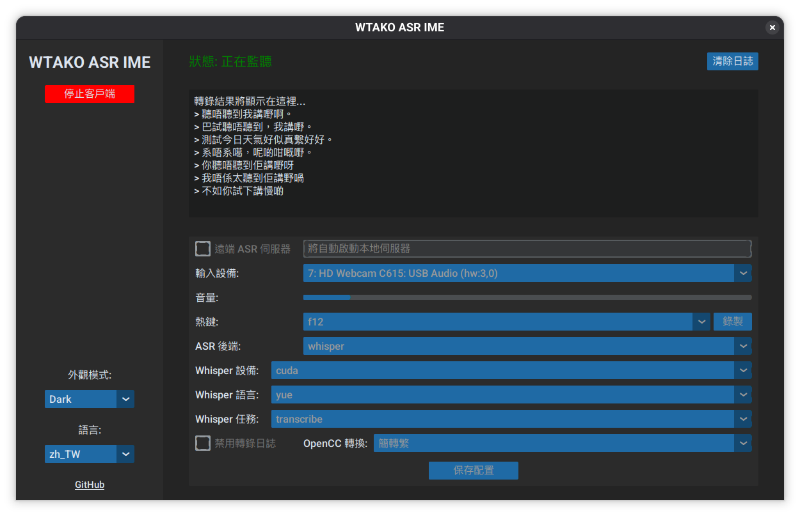

# WTAKO ASR IME



> [!IMPORTANT]
> **Linux Only**: This project is designed for Linux systems and relies on Linux-specific features like `uinput`.

A real-time Speech-to-Text (STT) system specifically optimized for **Cantonese** users, providing high-accuracy transcription for dialects. It supports multiple backends (GLM-ASR, SenseVoice) and local or remote ASR processing, making it ideal for offloading computation to a more powerful machine (like an AMD laptop with a GPU/NPU).

## Project Structure

```
.
├── client/
│   ├── gui.py               # Modern GUI entry point (CustomTkinter)
│   ├── main.py              # CLI entry point & Core logic (VAD, recording, typing)
│   ├── keyboard_listener.py # Captures hotkey events (requires sudo)
│   └── config.json          # Client configuration
├── server/
│   └── server.py            # ASR HTTP server (GLM-ASR model)
├── i18n/                    # Internationalization files (en, zh_TW)
├── assets/                  # Notification sounds
├── requirements.txt         # Python dependencies
└── README.md
```

## Features

- **Multi-Backend Support**: Choose between different ASR backends:
    - **GLM-ASR**: Powered by [GLM-ASR-Nano-2512](https://huggingface.co/zai-org/GLM-ASR-Nano-2512), a 1.5B parameter model that outperforms Whisper V3 on multiple benchmarks with exceptional dialect support (Mandarin, Cantonese, English).
    - **SenseVoice**: High-performance ASR using [SenseVoice](https://github.com/k2-fsa/sherpa-onnx) via `sherpa-onnx`. Supports automatic model downloading. **Recommended for CPU-only or weak GPU setups** due to its efficient quantized inference.
    - **Whisper**: Support for OpenAI's [Whisper V3 Large](https://huggingface.co/openai/whisper-large-v3) via Hugging Face Transformers.
- **Modern GUI**: User-friendly interface built with `CustomTkinter` for easy configuration and monitoring.
- **Real-time VAD**: Uses Silero VAD to detect speech and automatically stop recording.
- **Global Hotkey**: Customizable hotkey (default **F12**) to start recording.
- **Automatic Typing**: Transcribed text is automatically typed into your active window using `uinput`.
- **System Prompts**: Highly customizable via system prompts, allowing users to guide the ASR model's output for specific domains or styles.
- **Traditional Chinese Support**: Built-in Simplified to Traditional Chinese conversion (OpenCC).
- **Multi-language UI**: Supports English and Traditional Chinese (auto-detected or configurable).
- **Distributed Architecture**: Run the ASR model on a separate machine to save resources on your main workstation.

## Installation

1.  **Clone the repository**:
    ```bash
    git clone https://github.com/Saren-Arterius/WTAKO-ASR-IME.git
    cd WTAKO-ASR-IME
    ```

2.  **Install dependencies**:

    **System Dependencies (Ubuntu/Debian)**:
    ```bash
    sudo apt update
    sudo apt install portaudio19-dev libuinput-dev pulseaudio-utils pipewire-bin
    ```

    **Python Dependencies**:
    This project uses [uv](https://github.com/astral-sh/uv) for fast dependency management.

    **Using Setup Script (Recommended)**:
    A `setup.sh` script is provided to simplify the process. It automatically handles switching between CUDA and ROCm `pyproject.toml` files and lockfiles.

    ```bash
    # For NVIDIA (CUDA)
    ./setup.sh --nvidia

    # For AMD (ROCm 6.4)
    ./setup.sh --rocm
    ```

    **Manual Installation (Alternative)**:

    **NVIDIA (CUDA)**:
    ```bash
    cp pyproject.cuda.toml pyproject.toml
    uv sync --extra cuda
    ```

    **AMD (ROCm)**:
    ```bash
    cp pyproject.rocm.toml pyproject.toml
    uv sync --extra rocm
    ```

    *Note: For some AMD GPUs (like RX 680M), you may need to override the GFX version:*
    ```bash
    export HSA_OVERRIDE_GFX_VERSION=10.3.5
    ```

3.  **Download SenseVoice Model (Optional)**:
    The SenseVoice backend will automatically download the required models on first run. If you prefer to download them manually:
    ```bash
    curl -SL -O https://github.com/k2-fsa/sherpa-onnx/releases/download/asr-models/sherpa-onnx-sense-voice-zh-en-ja-ko-yue-int8-2024-07-17.tar.bz2
    tar xvf sherpa-onnx-sense-voice-zh-en-ja-ko-yue-int8-2024-07-17.tar.bz2
    rm sherpa-onnx-sense-voice-zh-en-ja-ko-yue-int8-2024-07-17.tar.bz2
    ```

4.  **Setup uinput permissions**:
    To allow the application to emulate keyboard input without running everything as root:
    ```bash
    sudo modprobe uinput
    sudo usermod -aG input $USER
    # You may need to logout and login for group changes to take effect
    ```
    Alternatively, ensure your user has write access to `/dev/uinput` (e.g., `sudo chmod 666 /dev/uinput`).

5.  **Setup Sudoers for Global Hotkey**:
    The global hotkey listener requires `sudo` to access raw input devices. To avoid being prompted for a password every time you start the client, add a `sudoers` entry. Run `sudo visudo` and add the following line at the end (replacing `/path/to/python` and `/path/to/project` with your actual paths):

    ```bash
    # Allow running the keyboard listener without a password
    your_username ALL=(ALL) NOPASSWD: /path/to/python /path/to/project/client/keyboard_listener.py *
    ```
    *Note: You can find your python path by running `which python` or `uv run which python`.*

6.  **Configure**:
    The application will create/update `client/config.json` automatically. You can also edit it manually or via the GUI.

## Usage

### 1. GUI Mode (Recommended)

The GUI provides a convenient way to manage settings and see transcriptions in real-time.

```bash
./start-gui.sh
```

**For AMD ROCm users (if override is needed):**
```bash
./start-gui.sh --gfx 10.3.5
```

### 2. CLI Mode

For a lightweight experience, you can run the CLI client.

```bash
# Local ASR
uv run client/main.py

# Remote ASR
uv run client/main.py --asr-server http://<server-ip>:8000
```

### 3. Standalone Server

If you want to run the ASR server on a different machine:

```bash
# Default (GLM)
uv run server/server.py --port 8000

# SenseVoice
uv run server/server.py --port 8000 --backend sensevoice
```

## Configuration

Settings can be adjusted via the GUI or by editing `client/config.json`:

- `audio_devices`: List of substrings to match your preferred microphone.
- `hotkey`: The key used to trigger recording (e.g., `f12`, `caps lock`).
- `system_prompt`: Instructions for the ASR model.
- `opencc_convert`: OpenCC conversion mode (`s2t`, `t2s`, or `null`).
- `language`: UI language (`auto`, `en`, `zh_TW`).
- `sound_up`/`sound_down`: Paths to notification sounds.

## Requirements

- **Linux**: Required for `uinput` (keyboard emulation) and Unix domain sockets.
- **Sudo Privileges**: Required for the keyboard listener to capture global hotkeys.
- **Audio System**: `pw-play` (PipeWire) or `aplay` for sounds; `pactl` for automatic muting during recording.
- **Python 3.10+** (Recommended)
- **Hardware**: 
    - **Client**: Any modern CPU.
    - **Server**: GPU (NVIDIA/AMD) recommended for real-time performance.
        - **CPU-only / Weak GPU**: Use the **SenseVoice** backend for the best performance on limited hardware.

## Troubleshooting

### 1. Keyboard Listener (Sudo)
The global hotkey listener requires `sudo` to access raw input devices. If you haven't set up the `sudoers` entry as described in the Installation section, you will be prompted for your password in the terminal.

### 2. uinput Errors
If you see errors related to `/dev/uinput`:
- Ensure the module is loaded: `sudo modprobe uinput`
- Ensure your user has permissions: `sudo chmod 666 /dev/uinput` (not recommended for production) or use the `udev` rules approach.

### 3. Audio Device Not Found
If the application picks the wrong microphone:
- Check the `audio_devices` list in `client/config.json`.
- Add a unique substring of your microphone's name (as seen in `pactl list sources` or the GUI dropdown) to the beginning of the list.

### 4. Muting Not Working
The auto-mute feature uses `pactl`. Ensure `pulseaudio-utils` or `pipewire-pulse` is installed and `pactl set-sink-mute @DEFAULT_SINK@ 1` works manually.
