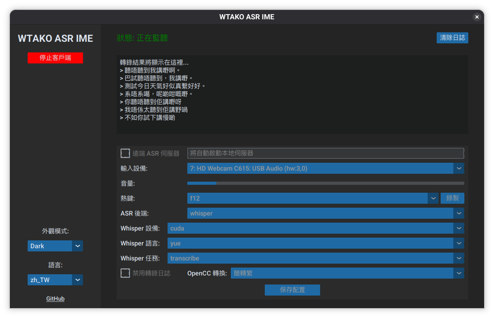

# WTAKO ASR IME



> [!IMPORTANT]
> **Linux Only**: This project is designed for Linux systems and relies on Linux-specific features like `uinput`.

A real-time Speech-to-Text (STT) system specifically optimized for **Cantonese** users, providing high-accuracy transcription for dialects. It supports multiple backends (GLM-ASR, SenseVoice) and local or remote ASR processing, making it ideal for offloading computation to a more powerful machine (like an AMD laptop with a GPU/NPU).

This repository contains **two tools**:

- **ASR IME**: Real-time speech input with hotkey-triggered recording, VAD, and automatic typing into the active window.
- **SRT Generate & Translate**: A standalone subtitle workflow that:
  - extracts/segments speech from video/audio,
  - generates source-language subtitles,
  - optionally runs speaker diarization (pyannote),
  - translates subtitles with LLM backends.

## Project Structure

```
.
├── client/
│   ├── gui.py               # Modern GUI entry point (CustomTkinter)
│   ├── main.py              # CLI entry point & Core logic (VAD, recording, typing)
│   ├── keyboard_listener.py # Captures hotkey events (requires sudo)
│   └── config.json          # Client configuration
├── server/
│   └── server.py            # ASR HTTP server (GLM-ASR model)
├── i18n/                    # Internationalization files (en, zh_TW)
├── assets/                  # Notification sounds
├── srt-generate-translate/  # SRT generation and translation tool
│   ├── gui.py               # GUI for SRT tool
│   ├── srt.py               # Core logic for SRT generation/translation
│   └── srt_config.json      # Configuration for SRT tool
├── requirements.txt         # Python dependencies
└── README.md
```

## ASR IME Features

- **Multi-Backend Support**: Choose between different ASR backends:
    - **GLM-ASR**: Powered by [GLM-ASR-Nano-2512](https://huggingface.co/zai-org/GLM-ASR-Nano-2512), a 1.5B parameter model that outperforms Whisper V3 on multiple benchmarks with exceptional dialect support (Mandarin, Cantonese, English).
    - **SenseVoice**: High-performance ASR using [SenseVoice](https://github.com/k2-fsa/sherpa-onnx) via `sherpa-onnx`. Supports automatic model downloading. **Recommended for CPU-only or weak GPU setups** due to its efficient quantized inference.
    - **Whisper**: Support for OpenAI's [Whisper V3 Large](https://huggingface.co/openai/whisper-large-v3) via Hugging Face Transformers.
- **Modern GUI**: User-friendly interface built with `CustomTkinter` for easy configuration and monitoring.
- **Real-time VAD**: Uses Silero VAD to detect speech and automatically stop recording.
- **Global Hotkey**: Customizable hotkey (default **F12**) to start recording.
- **Automatic Typing**: Transcribed text is automatically typed into your active window using `uinput`.
- **System Prompts**: Highly customizable via system prompts, allowing users to guide the ASR model's output for specific domains or styles.
- **Traditional Chinese Support**: Built-in Simplified to Traditional Chinese conversion (OpenCC).
- **Multi-language UI**: Supports English and Traditional Chinese (auto-detected or configurable).
- **Distributed Architecture**: Run the ASR model on a separate machine to save resources on your main workstation.

## ASR IME Installation

1. **Clone the repository**:
   ```bash
   git clone https://github.com/Saren-Arterius/WTAKO-ASR-IME.git
   cd WTAKO-ASR-IME
   ```

2. **Install system dependencies (Ubuntu/Debian)**:
   ```bash
   sudo apt update
   sudo apt install portaudio19-dev libuinput-dev pulseaudio-utils pipewire-bin
   ```

3. **Install Python dependencies** (using [uv](https://github.com/astral-sh/uv)):

   **NVIDIA (CUDA)**:
   ```bash
   uv pip install torch torchaudio torchvision torchcodec
   uv pip install -r requirements.txt
   ```

   **AMD (ROCm)**:
   ```bash
   uv pip install torch==2.9.1 torchvision==0.24.1 torchaudio==2.9.1 --index-url https://download.pytorch.org/whl/rocm6.4
   uv pip install rocrand
   uv pip install -r requirements.txt
   ```

   *ROCm notes:*
   - `rocrand` is required for diarization.
   - Keep `torchaudio` at `<=2.9.0` for compatibility.
   - For some AMD GPUs (like RX 680M), you may need:
   ```bash
   export HSA_OVERRIDE_GFX_VERSION=10.3.0
   ```

4. **Setup `uinput` permissions (ASR IME only)**:
   ```bash
   sudo modprobe uinput
   sudo usermod -aG input $USER
   ```
   Then logout/login for group changes to take effect.

5. **Setup sudoers for global hotkey (ASR IME only)**:
   Run `sudo visudo` and add:
   ```bash
   your_username ALL=(ALL) NOPASSWD: /path/to/python /path/to/project/client/keyboard_listener.py *
   ```

6. **Configure ASR IME**:
   Edit `client/config.json` manually or via GUI.

## ASR IME Usage

### GUI (recommended)
```bash
./start-gui.sh
```

For AMD ROCm override if needed:
```bash
./start-gui.sh --gfx 10.3.5
```

### CLI client
```bash
# Local ASR
uv run client/main.py

# Remote ASR
uv run client/main.py --asr-server http://<server-ip>:8000
```

### Standalone server
```bash
# Default (GLM)
uv run server/server.py --port 8000

# SenseVoice
uv run server/server.py --port 8000 --backend sensevoice
```

## SRT Generate & Translate Installation

1. **Use the same Python environment/dependencies as above**.

2. **Diarization prerequisites (SRT tool)**:
   - Set `HF_TOKEN` before running diarization.
   - Your Hugging Face account must have access to:
     `https://huggingface.co/pyannote/speaker-diarization-community-1`

3. **SenseVoice model (optional for both ASR IME and SRT tool)**:
   The backend can auto-download on first run, or download manually:
   ```bash
   curl -SL -O https://github.com/k2-fsa/sherpa-onnx/releases/download/asr-models/sherpa-onnx-sense-voice-zh-en-ja-ko-yue-int8-2024-07-17.tar.bz2
   tar xvf sherpa-onnx-sense-voice-zh-en-ja-ko-yue-int8-2024-07-17.tar.bz2
   rm sherpa-onnx-sense-voice-zh-en-ja-ko-yue-int8-2024-07-17.tar.bz2
   ```

4. `uinput` and global hotkey are **ASR IME only** and not required for SRT generation/translation.

## SRT Generate & Translate Usage

### GUI
```bash
uv run srt-generate-translate/gui.py
```

### CLI
```bash
uv run srt-generate-translate/srt.py --help
```

> [!TIP]
> **Font Issues with `uv`**: If you find that the GUI only displays a "fixed" font and cannot show CJK characters correctly, it's likely because `uv`'s portable Python binaries are not integrated with your system's font configuration.
>
> To fix this, recreate your virtual environment using the system's Python:
> ```bash
> rm -rf .venv
> uv venv --python $(which python3)
> uv pip install -r requirements.txt
> ```

## Configuration

`client/config.json` and `srt-generate-translate/srt_config.json` are different and unrelated:

- **`client/config.json` (ASR IME only)**  
  Controls realtime input behavior for the IME client (e.g., `audio_devices`, `hotkey`, typing/system prompt behavior, UI language, sound settings).

- **`srt-generate-translate/srt_config.json` (SRT tool only)**  
  Controls subtitle pipeline settings (e.g., `ASR_API_URL`, `ASR_MODEL`, `ASR_BACKEND`, `SOURCE_LANG`, `DEST_LANG`, `LLM_API_URL`, `LLM_MODEL`, merge/diarization options, `video_files`, translation `context`, and SRT save/debug flags).

Changes in one config file do **not** affect the other tool.

ASR IME settings can be adjusted via GUI or by editing `client/config.json`:

- `audio_devices`: List of substrings to match your preferred microphone.
- `hotkey`: The key used to trigger recording (e.g., `f12`, `caps lock`).
- `system_prompt`: Instructions for the ASR model.
- `opencc_convert`: OpenCC conversion mode (`s2t`, `t2s`, or `null`).
- `language`: UI language (`auto`, `en`, `zh_TW`).
- `sound_up`/`sound_down`: Paths to notification sounds.

## Requirements

- **Linux**: Required for `uinput` (keyboard emulation) and Unix domain sockets.
- **Sudo Privileges**: Required for the keyboard listener to capture global hotkeys.
- **Audio System**: `pw-play` (PipeWire) or `aplay` for sounds; `pactl` for automatic muting during recording.
- **Python 3.10+** (Recommended)
- **Hardware**: 
    - **Client**: Any modern CPU.
    - **Server**: GPU (NVIDIA/AMD) recommended for real-time performance.
        - **CPU-only / Weak GPU**: Use the **SenseVoice** backend for the best performance on limited hardware.

## Troubleshooting

### 1. Keyboard Listener (Sudo)
The global hotkey listener requires `sudo` to access raw input devices. If you haven't set up the `sudoers` entry as described in the Installation section, you will be prompted for your password in the terminal.

### 2. uinput Errors
If you see errors related to `/dev/uinput`:
- Ensure the module is loaded: `sudo modprobe uinput`
- Ensure your user has permissions: `sudo chmod 666 /dev/uinput` (not recommended for production) or use the `udev` rules approach.

### 3. Audio Device Not Found
If the application picks the wrong microphone:
- Check the `audio_devices` list in `client/config.json`.
- Add a unique substring of your microphone's name (as seen in `pactl list sources` or the GUI dropdown) to the beginning of the list.

### 4. Muting Not Working
The auto-mute feature uses `pactl`. Ensure `pulseaudio-utils` or `pipewire-pulse` is installed and `pactl set-sink-mute @DEFAULT_SINK@ 1` works manually.
